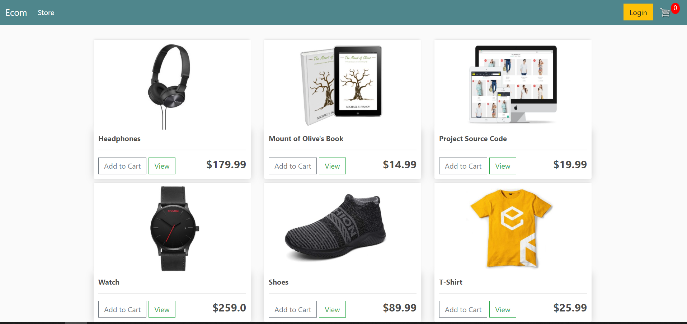
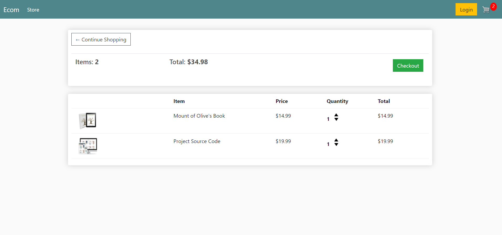
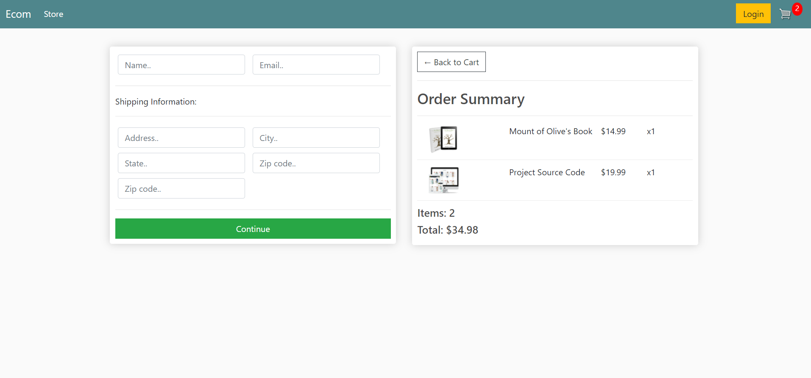

# Ecommerce App

Hello there, this is an ecommerce web.

### Table of Contents

- [Technologies](#Technologies)
- [Knowledge](#Knowledge)
- [Features](#Features)

#### Technologies

- Python
- Django 

### Knowledge
  - I have learned to build a functional Login/Signup 
  - Understood the major logic of MVT 
  - Gained basic knowledge on Models , Views ,Templates and URLs
  - Manipulated with sandbox as stimulation of paypal
  - Successfully built a cart with feature such as increasing/decreasing item quantity 
  
 

### Features
  - Register User
  - Login/Logout User
  - CRUD 
  - Cart features
 
